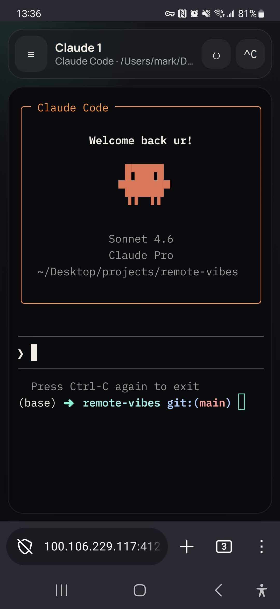
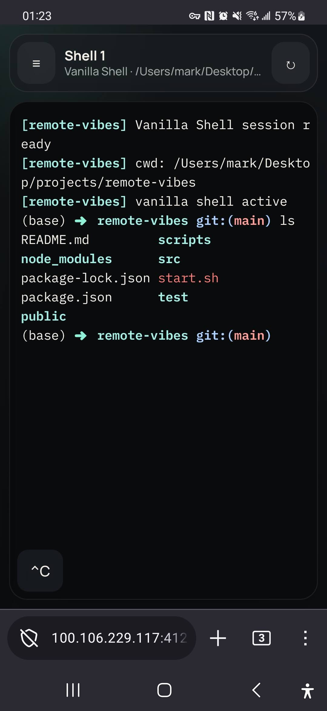
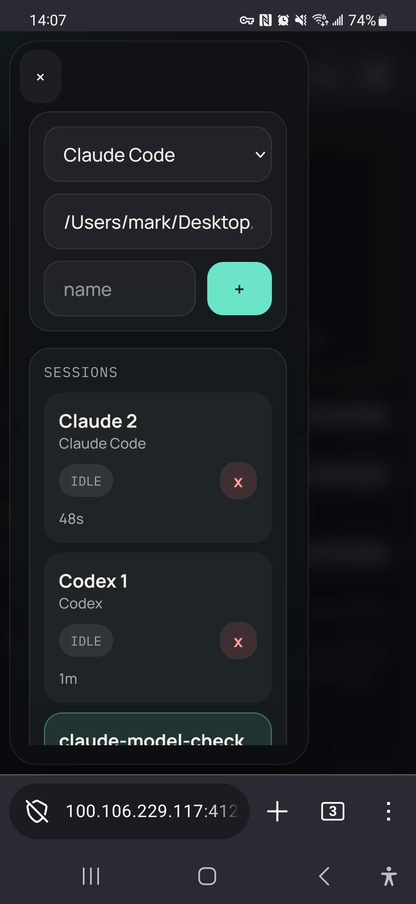
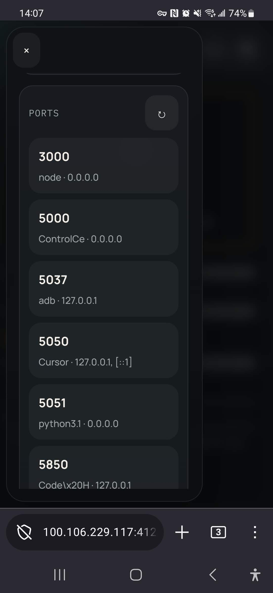

# Vibe Research

## Quickstart

Minimal browser terminal to vibe code on your server/cluster/Mac/Raspberry Pi via your phone/laptop on the go.

1. On the machine you want to control, run `curl -fsSL https://vibe-research.net/install.sh | bash`
2. Later, run `vibe-research` from a terminal to launch it if needed and open the local UI in your browser.
3. From another device on the same network, open the LAN URL or scan the QR code printed by startup.
4. In Vibe Research, choose a workspace folder during onboarding, then tap New Agent. The Library is created under `<workspace>/vibe-research/buildings/library`, and agents start in `<workspace>/vibe-research/user`. The first Claude Code session will ask for Claude sign-in if needed.

Tailscale is optional for first setup. If it is already installed and connected, Vibe Research will print a Tailscale URL too. To have the installer install/start Tailscale onboarding for private remote access, run the quickstart with `VIBE_RESEARCH_INSTALL_TAILSCALE=1`.

Vibe Research is a local control plane for your machine. Do not expose port `4123` or a Vibe Research URL to the open internet unless you add a separate authentication layer. Prefer the Local URL, trusted LAN, or private Tailscale access.

## Desktop App

There is now a thin desktop launcher in `desktop/` for people who should not have to paste a curl command. Release builds open a native window, copy a bundled Vibe Research source template into `~/.vibe-research/app`, ensure Node.js exists, start the local server, then load the UI at `http://127.0.0.1:4123/`. This avoids requiring Git for a first-run desktop install.

Build it locally with:

```bash
npm run desktop:install
npm run desktop:dist
npm --prefix desktop run dist:mas
```

macOS artifacts are written to `desktop/dist/`. The GitHub Actions `Desktop` workflow builds `.dmg` and `.zip` artifacts plus update metadata. Release tags require Developer ID signing and Apple notarization secrets, then publish the files through GitHub Releases so installed desktop apps can auto-update.

Mac App Store packaging uses the `mas` target and needs App Store signing assets (`MAS_PROVISIONING_PROFILE` plus Mac App Store signing identities in `CSC_LINK`).

## Official Sources

- Website: https://vibe-research.net
- Repository: https://github.com/Clamepending/vibe-research
- Releases: https://github.com/Clamepending/vibe-research/releases
- Installer: `curl -fsSL https://vibe-research.net/install.sh | bash`

Do not run lookalike installers from unrelated domains, forks, package names, or social posts. Release pages include checksum assets for high-trust verification when available.

## Claude Code Install

The main installer does not require Claude Code to finish setup. It detects an existing `claude` command when present, then lets the onboarding UI install or choose a coding agent. Vibe Research prefers the native `~/.local/bin/claude` binary over older npm/Homebrew shims when both are present.

If you explicitly set `VIBE_RESEARCH_INSTALL_CLAUDE_CODE=1`, the shell installer runs Anthropic's native installer and falls back to a user-local npm install under `~/.local` if the native installer exits or does not finish within 10 minutes. Set `VIBE_RESEARCH_CLAUDE_CODE_INSTALL_TIMEOUT_SECONDS=0` to disable that timeout.

```bash
VIBE_RESEARCH_INSTALL_CLAUDE_CODE=1 curl -fsSL https://vibe-research.net/install.sh | bash
```

The onboarding UI also offers Claude Code, Codex, OpenClaw, OpenCode, Gemini CLI, and ML Intern install/detection from the provider picker.

### Local Claude Code with Ollama

Vibe Research also detects a local-only `Local Claude Code (Ollama)` provider when both `claude` and `ollama` are installed. Sessions launched through this provider keep the Claude Code UI and Vibe Research wrapper, but route model traffic to Ollama with:

```bash
ANTHROPIC_AUTH_TOKEN=ollama
ANTHROPIC_API_KEY=local
ANTHROPIC_BASE_URL=http://localhost:11434
CLAUDE_CODE_DISABLE_NONESSENTIAL_TRAFFIC=1
```

The provider launches Claude Code with `--model "${VIBE_RESEARCH_CLAUDE_OLLAMA_MODEL:-qwen3-coder}"`. Pull the model before using an air-gapped machine, for example `ollama pull qwen3-coder`, or set `VIBE_RESEARCH_CLAUDE_OLLAMA_MODEL=qwen2.5-coder:7b` to use a different local model. Make sure Ollama is running (`ollama serve` or the desktop app), and set `VIBE_RESEARCH_CLAUDE_OLLAMA_BASE_URL` if it listens somewhere other than `http://localhost:11434`.

## Details...

Use the `vibe-research.net` installer URL directly. It is a small stable wrapper around the canonical installer in this repo. If a very minimal machine does not have `curl` yet, install `curl` first and rerun the quickstart command.

The installer handles git, build tools, Node.js 22.x, Vibe Research, and startup on supported macOS/Linux/Raspberry Pi systems. It detects an already-connected Tailscale setup but does not require Tailscale login on first run. On Linux installs, `tmux` is installed too so coding-agent terminals can survive Vibe Research restarts.

Interactive terminals get a polished installer view with a Vibe Research header, step progress, and a small loading spinner. Set `VIBE_RESEARCH_INSTALL_UI=plain` for simple logs, or `VIBE_RESEARCH_INSTALL_ANIMATION=0` to keep the styled step output without animation.

By default, the installer uses the latest GitHub Release when one exists, then falls back to `main` while the project is still bootstrapping. Set `VIBE_RESEARCH_UPDATE_CHANNEL=branch` or `VIBE_RESEARCH_REF=<branch-or-tag>` before running the installer if you intentionally want a dev checkout.

The install command now launches Vibe Research as a background server, so it keeps running even after the SSH session or terminal closes. The app checkout lives under `~/.vibe-research/app`; onboarding chooses the workspace where the Library and agent-created files live; settings, logs, session history, and the managed pid live under `~/.vibe-research/`. Coding-agent terminals use `tmux` when available so Vibe Research restarts can reattach to live agent work instead of merely replaying a transcript.

The installer adds a `vibe-research` terminal command, preferring a bin directory already on `PATH` and falling back to `~/.local/bin`. Running `vibe-research` starts the background server when needed and opens the local browser UI; use `vibe-research --no-browser` on headless machines. If your current shell has not picked up the install location, open a new terminal or add the printed directory to `PATH`.

To remove the terminal command, background service, and app checkout, run `vibe-research uninstall`. It keeps local Vibe Research state by default; use `vibe-research uninstall --purge` only when you also want to remove local settings, logs, and session state.

New release installs start workspace picking from `~/vibe-projects` when the app checkout is under `~/.vibe-research/app`. New agents start in the configured new-agent folder without asking for a folder each time; Settings can change both the Library folder and the new-agent folder. By default, Vibe Research keeps local git backups of the Library every 10 minutes. To back the Library up off-machine, create a private Git repo, paste its SSH or credential-helper remote URL into the sidebar's private remote backup field, enable remote push, and Vibe Research will push Library backup commits there on each backup run.

## Releases

Vibe Research uses GitHub Releases as the stable update channel. Friends' installs update to release tags like `v0.2.1`, not random in-progress commits on `main`. The repo also carries `release-channel.json`, a static stable-channel pointer used as a lower-rate fallback before GitHub's releases API.

The safest path is the manual GitHub Actions workflow:

1. Open GitHub Actions.
2. Select `Release`.
3. Click `Run workflow`.
4. Choose `patch`, `minor`, or `major`.

The workflow checks out a clean copy, installs Node.js 22, runs the full test suite, bumps the version, creates the tag, and publishes the GitHub Release.

You can still cut a release locally from a clean `main` checkout:

```bash
npm run release:patch
npm run release:minor
npm run release:major
```

Both paths bump `package.json`, update `release-channel.json`, commit `Release vX.Y.Z`, create an annotated git tag, push `main` and the tag, then publish a GitHub Release with generated notes plus checksum assets (`install.sh`, `release.json`, and `SHASUMS256.txt`). The in-app updater checks the static release channel and latest GitHub Release before falling back to semver tags or `main`.

You can access local app ports from the sidebar. Vibe Research prefers direct
`http://<host-ip>:<port>/` links when a service is already listening on all
interfaces. When Tailscale is connected, it also shows private tailnet URLs and
offers an `expose` button for localhost-only services via Tailscale Serve. It
keeps `/proxy/<port>/` as the fallback.

Example thing I did was text my agent to fix and [pretrain GPT2-small on a 4090!](https://x.com/clamepending/status/2039185482639462763?s=20)

Agents inside Vibe Research get a Playwright CLI browser skill on `PATH` via `vr-playwright`, `playwright-cli`, and `PWCLI`. This is the preferred way for agents to inspect localhost apps with a real browser:

```bash
command -v npx >/dev/null 2>&1
export PWCLI="${PWCLI:-vr-playwright}"
"$PWCLI" open http://127.0.0.1:4173
"$PWCLI" snapshot
"$PWCLI" click e15
"$PWCLI" fill e2 "make it cinematic"
"$PWCLI" press Enter
"$PWCLI" screenshot --filename output/playwright/final.png
```

The key loop is: open the page, snapshot to get stable element refs, interact with refs from the newest snapshot, snapshot again after UI changes, and save artifacts under `output/playwright/`. `vr-playwright` runs `npx --package @playwright/cli playwright-cli`, so agents do not need a global `playwright-cli` install as long as Node/npm provide `npx`.

`vr-browser` is still available as a fallback for qualitative visual feedback from Codex or Claude:

```bash
vr-browser describe 4173 --prompt "What visual issues stand out in the rendered UI?"
vr-browser describe-file results/chart.png --prompt "Critique this chart's readability."
```

For model training or experiment loops, the lightweight pattern is:
- serve the demo or chart on localhost and inspect it with `vr-playwright open`, `snapshot`, interactions, and `screenshot`
- save generated images or plots to disk and use `vr-browser describe-file` for a qualitative read
- ask the agent to write a short keep-training / stop-training note grounded in those rendered artifacts

## ML Intern

Vibe Research detects Hugging Face's `ml-intern` CLI when it is installed and shows it as an agent provider. Install it from the upstream repo, then start an `ML Intern` session from the provider picker:

```bash
git clone https://github.com/huggingface/ml-intern.git
cd ml-intern
uv sync
uv tool install -e .
```

`ml-intern` needs `HF_TOKEN`, and usually `ANTHROPIC_API_KEY` and `GITHUB_TOKEN`, in the environment used by the Vibe Research server. `HF_TOKEN`, `ANTHROPIC_API_KEY`, and `OPENAI_API_KEY` can also be saved in Vibe Research under Settings -> Model Provider Keys; saved values are injected into newly started agent sessions without being returned by `/api/settings`. Sessions run in the same persistent terminal system as other agents, so a restart can reattach to live training monitors or long HF job supervision.

For a one-move Vibe Research handoff, agent sessions expose:

```bash
ml-intern "$(cat "$VIBE_RESEARCH_ML_INTERN_HANDOFF_PROMPT")"
```

That prompt tells ML Intern to keep Vibe Research as the research ledger: claim one QUEUE row, run 1-3 committed cycles, cite papers/datasets/jobs/artifacts, update the result doc and leaderboard, and push the Library/code repos.

For a repeatable live agent smoke test inside a Vibe Research shell session, run:

```bash
node scripts/eval-vr-browser-codex.mjs --provider codex
node scripts/eval-vr-browser-codex.mjs --provider claude
```

tips:
- Press the "shift+tab" button on the top right to swap to bypass-permisisons mode to not have to approve things all the time.
- Use builtin voice to text to just speak and send commands

<p align="center">
  <a href="claude_code.jpg"></a>
  <a href="shell.jpg"></a>
</p>

<p align="center">
  <a href="menu1.jpg"></a>
  <a href="menu2.jpg"></a>
</p>


Sessions are saved, and coding-agent sessions use persistent `tmux` terminals when available, so restarts are much less likely to interrupt in-progress agent work. The file explorer lets you see image files by tapping on them (useful for graphs).
