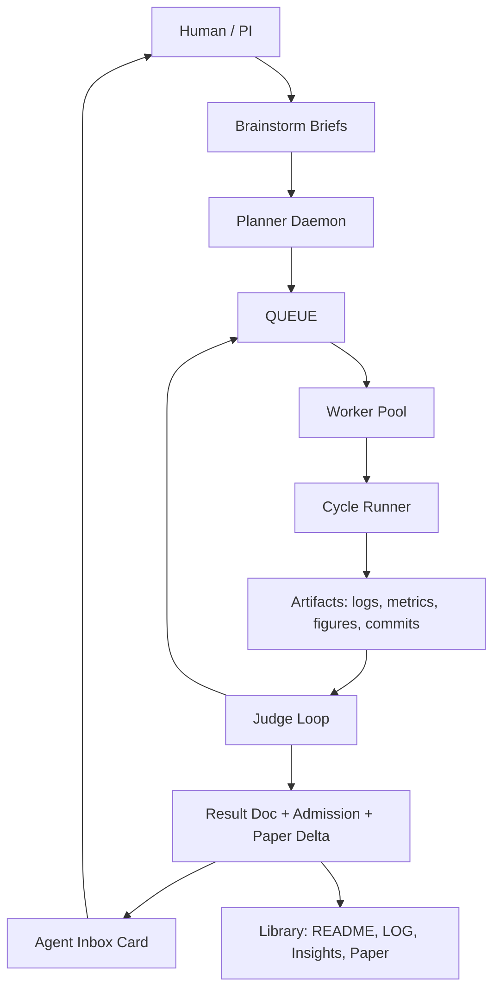

# Agent-Native Vibe Research Roadmap

Date: 2026-04-30

This is the working plan for turning Vibe Research from an agent launcher plus research ledger into an agent-native research organization. It synthesizes:

- [Autonomous Research Organizations Literature Review](./autonomous-research-org-literature-review.md)
- [Cursor Long-Horizon Agent Lessons](./cursor-long-horizon-agent-lessons.md)
- [Visual OS Foundation](./visual-os-foundation.md)
- the current runner implementation: `vr-research-brief`, `vr-research-runner`, `vr-research-doctor`, `vr-research-admit`, `vr-research-resolve`, Agent Inbox, and Agent Canvas.

## North Star

Vibe Research should make autonomous research feel like running a small accountable lab:

- The human sets goals, constraints, budgets, and taste.
- Agents propose plans, run experiments, write results, and surface crisp review points.
- Evaluators decide what is measurable; humans decide what matters.
- Every claim is linked to a branch, command, artifact, metric, review, or human decision.
- Long-horizon autonomy is achieved through fresh cycles, strong verifiers, and artifact review, not by asking one chat to remember everything.

The product principle is: optimize for human review throughput. The human should see the current artifact, the metric/noise state, the next recommended action, and one-click steering. The system may run many cycles underneath, but it should only interrupt at meaningful decision points.

## Synthesis

### From AlphaEvolve And FunSearch

Use evolutionary search only where evaluation is strong enough. The transferable pattern is:

| Discovery-system concept | Vibe Research equivalent |
| --- | --- |
| Program database | Result docs, branches, artifacts, figures, insights |
| Sampler | Brief/queue proposer, prompt/scaffold/topology generator |
| Evaluator | Tests, benchmark scores, doctor, admit, lint, human rubric |
| Selection | Leaderboard, review mode, insight promotion |
| Diversity | Separate moves, branches, seeds, project scopes |

Implication: Vibe should evolve prompts, queue policies, scaffold recipes, benchmark harnesses, and topology rules before it attempts open-ended scientific hypothesis search.

### From Autonomous Research Systems

AI Scientist, AI co-scientist, and Agent Laboratory all point toward staged autonomy:

1. Brainstorm candidate questions.
2. Ground with literature, docs, data schema, and prior results.
3. Plan one move with a falsifier and expected artifact.
4. Execute cycles with durable outputs.
5. Analyze and write a result doc.
6. Review admission, limitations, paper updates, and insights.
7. Govern pivots, budgets, publishing, and sensitive actions.

Implication: Vibe should make stage transitions explicit and reviewable. Automated review is a triage layer, not final truth.

### From Human-Agent Teaming

The human should be a teammate, not a button. Useful cards answer:

- What decision is needed?
- Why now?
- What evidence should I inspect?
- What will happen if I click continue, rerun, synthesize, brainstorm, steer, pause, or reject?
- What capability or budget is being requested?

Implication: Agent Inbox should become the universal fast steering surface, with cards linked to exact artifacts and predicates agents can wait on.

### From Cursor / FastRender

The lesson is not "run a huge swarm." Cursor's stronger pattern was:

- planners, workers, and judges, not a flat peer swarm;
- fresh cycles to reduce drift and tunnel vision;
- hard feedback loops: compiler, tests, specs, screenshots, golden comparisons, logs, videos;
- sandboxed environments with resumable state;
- artifact-first review so the human can judge without replaying a transcript.

Implication: Vibe needs an orchestrator above the runner: planner daemon, worker pool, judge loop, artifact-first cards, and isolated runtimes for serious jobs.

## Current Baseline

Already in place or now mostly in place:

- `vr-research-brief`: brainstorm-to-experiment handoff.
- `vr-research-runner claim/run/cycle/finish`: worker loop for claiming moves, running commands, capturing artifacts, committing code, aggregating metrics, and resolving moves.
- `vr-research-doctor`: project integrity check.
- `vr-research-admit`: noise-aware leaderboard gate.
- `vr-research-resolve`: README/LOG application.
- Agent Inbox choices: `continue`, `rerun`, `synthesize`, `brainstorm`, `steer`.
- Agent Canvas: current visual artifact for human review.
- Benchmark discipline: qualitative/mix projects need versioned rubrics or judge prompts.

This is enough to run a single agent through a real queued move with durable evidence. The missing layer is autonomous orchestration across moves and agents.

## Target Architecture



### Roles

| Role | Owns | Main output | Human touchpoint |
| --- | --- | --- | --- |
| Human / PI | Goals, budgets, taste, sensitive approvals | Direction and constraints | Cards for pivots, spend, publication, insight promotion |
| Planner daemon | Brainstorm/review phases | Briefs and QUEUE candidates | Approve and queue |
| Worker | One move on one branch | Cycle commits, logs, result doc | Continue/rerun/steer card |
| Judge | Evaluation and integrity | Admit verdict, critique, next recommendation | Synthesize/brainstorm/accept card |
| Librarian | Cross-move memory | Paper updates, insights, source map | Insight/paper review |
| Evaluator service | Metrics and checks | Scores, plots, test logs, benchmark deltas | Shows uncertainty and failure modes |
| Safety/budget officer | Capability gates | Approval cards and budget stops | Human-only decisions |

## Roadmap

### Phase 1: Make The Single-Worker Loop Production-Grade

Goal: one agent can run a queued move end-to-end with minimal manual markdown editing.

Status: mostly implemented. The runner now handles claim/cycle/run/finish, human wait gates, result aggregation, live monitor URL publishing, paper updates, generated or copied figures, Agent Canvas publishing, and project budget debits/cap gates.

Remaining work:

- Extend `--wait-human` beyond the current Agent Town timeout cap for truly long review windows.

Success criteria:

- A toy and a real project both complete `brief -> queue -> run cycles -> finish -> doctor clean`.
- The human can review from Agent Inbox without opening a terminal.

### Phase 2: Build The Judge Loop

Goal: after every move, a judge creates one crisp review card and recommends continue, rerun, synthesize, or brainstorm.

Current implementation:

- `vr-research-judge <project-dir> --slug <slug>` audits a move without mutating project state.
- It reads the result doc, doctor, admit, lint-paper, and benchmark context where available.
- It emits a structured recommendation and can open an Agent Inbox card with `--ask-human`.

Build:

- Deepen the structured verdict:
  - claim audit;
  - evaluator strength;
  - missing provenance;
  - noise/rerun recommendation;
  - paper/insight suggestion;
  - next move candidates.
- Add artifact sniffing for logs, figures, screenshots, and live monitor URLs.

Success criteria:

- Judge catches missing provenance and weak evaluator cases before README/LOG updates.
- Human review time per move goes down without increasing doctor/lint failures.

### Phase 3: Planner Daemon And Review Mode

Goal: when a project is in brainstorm/review, agents propose grounded next moves instead of waiting for manual QUEUE edits.

Build:

- `vr-research-orchestrator tick <project-dir>`
- Reads `.vibe-research/research-state.json`, README, LOG, current leaderboard, insights, recent artifacts.
- If phase is `brainstorm`, create or update a brief.
- If phase is `review`, propose synthesis, rerun, sensitivity, ablation, or stop.
- Converts broad searches into sibling QUEUE moves, not sub-experiments inside one move.

Current implementation:

- `vr-research-orchestrator tick <project-dir>` is a deterministic dispatcher over phase state, doctor, ACTIVE, QUEUE, LOG, and the latest result.
- With queued work it recommends the concrete runner command.
- With planned/running `runs.tsv` sweeps and no queued move, it recommends `vr-rl-sweep run` before entering review.
- With exhausted `experiment` / `hillclimb` state, `--apply` safely transitions to `review`.
- With an existing reviewed brief, `--apply` compiles the selected candidate into QUEUE and moves the project to `experiment`.
- In `review` / `synthesis`, it invokes `vr-research-judge` logic and can open the human Agent Inbox card with `--ask-human`.
- It does not yet synthesize new LLM-written briefs; that remains the next planner layer.

Success criteria:

- Empty QUEUE no longer stalls unattended safe projects.
- Review mode distills insights after several moves.
- Human receives one approve-and-queue card, not a pile of ideas.

### Phase 4: Worker Pool

Goal: run multiple disjoint moves safely when the project topology allows it.

Build:

- Work allocator that claims different QUEUE rows for different workers.
- Per-worker branch and artifact directory.
- Stale worker detection and recovery.
- Budget-aware concurrency caps.
- Topology metadata in result docs:

```yaml
topology:
  owner: worker
  parallel_agents: 2
  reviewer_agents: 1
  human_touchpoints: ["cycle-review"]
  evaluator_strength: "hard-tests"
```

Success criteria:

- Parallel work improves wall time on decomposable projects.
- Doctor clean-rate stays equal or better than single-worker baseline.
- Conflicts remain rare and recoverable.

### Phase 5: Evolutionary Queue And Prompt Search

Goal: apply AlphaEvolve/ADAS-style search to Vibe's own workflows.

Build:

- A project such as `agent-org-design`.
- Artifacts under test: occupation prompt variants, scaffold recipes, topology policies, judge prompts, queue proposer prompts.
- Evaluators:
  - doctor clean-rate;
  - result-doc completeness;
  - admission correctness;
  - paper-lint clean-rate;
  - wall time;
  - human review time;
  - human satisfaction;
  - real move success.
- Archive of candidate policies and scores.

Success criteria:

- Prompt/topology changes are admitted only when they improve measured outcomes.
- No unreviewed prompt evolution affects normal user projects.

### Phase 6: Sandboxed Long-Horizon Runtime

Goal: make serious long-running research safe and resumable.

Build:

- Per-move runtime isolation for code execution.
- Persistent artifacts and checkpoints.
- Live monitor URL / screenshot / video capture.
- Credential and spend boundaries.
- Resume/fresh-start policy after each cycle.

Success criteria:

- Long jobs survive process restarts.
- Humans can inspect artifacts without reconstructing terminal state.
- Secrets and spend remain gated by capability cards.

## Evaluation Plan

Track these metrics across dogfood projects:

| Metric | Why it matters |
| --- | --- |
| Move completion rate | Does autonomy actually finish work? |
| Doctor clean-rate | Is the ledger staying valid? |
| Admit correctness | Are leaderboard changes evidence-backed? |
| Paper-lint clean-rate | Is the human-facing narrative trustworthy? |
| Human review latency | Are cards fast enough to use? |
| Human interventions per move | Is the system asking at the right granularity? |
| Rerun rate after judge review | Does the judge catch noise/weak evidence? |
| Budget per resolved result | Is autonomy wasting compute? |
| Artifact inspectability score | Can the human review without reading transcripts? |

## Near-Term Build Queue

1. Longer human wait gates for asynchronous review.
2. Real toy-to-real project proving run.
3. `vr-research-orchestrator tick`: phase-aware planner/reviewer.
4. Topology metadata in result docs plus doctor validation.
5. Program database view over results, artifacts, insights, and evaluator strength.
6. Worker pool with concurrency caps and stale-worker recovery.
7. `agent-org-design` dogfood project to evaluate prompt/topology changes.

## Open Questions To Refine

- What is the smallest first real benchmark project for the orchestrator?
- Should `vr-research-judge` be deterministic checks first, LLM critique second, or always both?
- What should count as a "human satisfaction" metric without making the UI annoying?
- Should worker pool branches merge into one result branch, or should each move remain separate forever?
- When should Vibe tolerate temporary broken commits, Cursor-style, versus requiring every cycle commit to pass?
- Which cloud/sandbox provider should be the first serious long-horizon runtime?
- What is the right default stop condition for unattended projects?

## Working Thesis

The next breakthrough for Vibe Research is not a smarter single agent. It is a tighter research operating system:

- typed state;
- executable evaluators;
- fresh worker contexts;
- compact human cards;
- artifact-first review;
- measurable topology choices;
- conservative governance.

Agents are replaceable workers. The Library is the institution.
